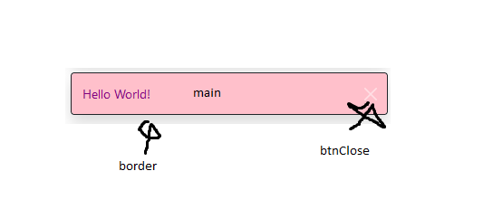
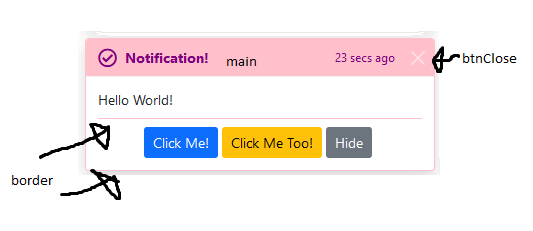
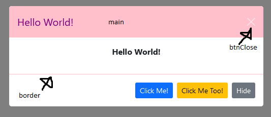
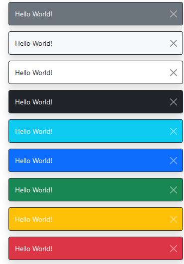
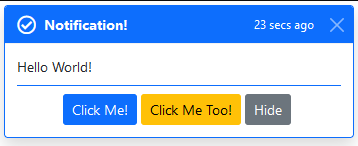
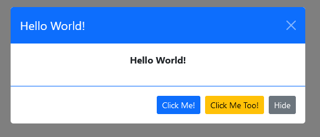
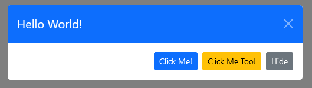
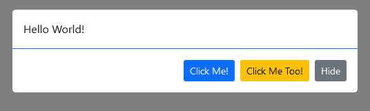

# bs5-utils
=======
# Bs5Utils - A JavaScript utility package for Bootstrap 5 components

---

A simple package to make the usage of various components within Bootstrap 5 easier to use.

If this package has helped you, and you're feeling particularly generous:
- **ETH/MATIC:** 0x6515654c8e931052ab17a63311411D475D503e59
- **ADA:** addr1qxaqvghsr8lu3wrmql4fcvg6txj5083s2a9rr5dmrrtjt0yn8t0x4yav3ma2flg3tzcu9767s7senydcumnf6c4krnnspn949q

**Note:** The package is also available on npmjs: https://www.npmjs.com/package/bs5-utils

---

Contents
-

- [Configuration](#configuration)
- [Theming](#theming)
- [API](#api)
- [Support & Contribute](#support--contribute)

Configuration
-

There are several defaults which you can customize:

```javascript
Bs5Utils.defaults.toasts.position = 'top-right';
Bs5Utils.defaults.toasts.container = 'toast-container';
Bs5Utils.defaults.toasts.stacking = false;
```

As `bs5Utils.Snack` is a subset of `bs5Utils.Toast`, the configuration for toasts will also apply to `bs5Utils.Sanck`.

Theming
-

You can register your own custom styles by passing classes to specific components by using the static
method `Bs5Utils.registerStyle`. The components you can customise are:

- `btnClose` - The dismiss button
- `main` - The area of the toast, snack, or modal which will display the `type` color
- `border` - The border of the component

These components have been clearly illustrated below. For the time being, the `border` style for `bs5Utils.Snack` cannot
be overridden.

**Note:** All of these keys _must_ be passed in the `styles` parameter object.

**Method Overview**

```javascript
/**
 * Register a style for the components
 * @param key - To reference your style
 * @param styles - The style object
 */
Bs5Utils.registerStyle(key, styles)
```

**Usage**

You first define your CSS classes:

```css
.bg-pink {
    background-color: pink;
}

.text-purple {
    color: purple;
}

.border-pink {
    border-color: pink !important;
}
```

Then you register the style:

```javascript
Bs5Utils.registerStyle('pink', {
    btnClose: ['btn-close-white'],
    main: ['bg-pink', 'text-purple'],
    border: ['border-pink']
});
```

Pass empty arrays if you wish to leave the default styles e.g.

```javascript
Bs5Utils.registerStyle('pink', {
    btnClose: [],
    main: ['bg-pink', 'text-purple'],
    border: ['border-pink']
});
```

Now, `pink` can be used as a `type` when displaying snacks, toasts, or modals e.g.

**Snack**



**Toast**



**Modal**



API
-

This package is based around the `Bs5Utils` class, so first things first, construct the object:

```javascript
const bs5Utils = new Bs5Utils();
```

Thereafter you'll be able to use the methods outlined below.

### Snacks

**Method Overview**

```javascript
/**
 * Display a lightweight toast for simple alerts
 * @param - type the theme of the snack
 * @param - title the title of the of the snack
 * @param - delay in ms, if specified the snack will autohide after the specified amount
 * @param - dismissible set whether the dismiss button should show
 */
bs5Utils.Snack.show(
    type,
    title,
    delay = 0,
    dismissible = true
);
```

**Usage**

```javascript
bs5Utils.Snack.show('secondary', 'Hello World!', delay = 0, dismissible = true);
bs5Utils.Snack.show('light', 'Hello World!', delay = 0, dismissible = true);
bs5Utils.Snack.show('white', 'Hello World!', delay = 0, dismissible = true);
bs5Utils.Snack.show('dark', 'Hello World!', delay = 0, dismissible = true);
bs5Utils.Snack.show('info', 'Hello World!', delay = 0, dismissible = true);
bs5Utils.Snack.show('primary', 'Hello World!', delay = 0, dismissible = true);
bs5Utils.Snack.show('success', 'Hello World!', delay = 0, dismissible = true);
bs5Utils.Snack.show('warning', 'Hello World!', delay = 0, dismissible = true);
bs5Utils.Snack.show('danger', 'Hello World!', delay = 0, dismissible = true);
```

**Example**



### Toasts

**Method Overview**

```javascript
/**
 * Display a toast for alerts
 * @param type - the theme of the snack
 * @param icon - Set an icon in the top-left corner, you can pass HTML directly
 * @param title - the title of the of the toast
 * @param subtitle - the subtitle of the toast
 * @param content - the content of the toast
 * @param buttons - the action buttons of the toast
 * @param delay - in ms, if specified the snack will autohide after the specified amount
 * @param dismissible - set whether the dismiss button should show
 */
bs5Utils.Toast.show({
    type,
    icon = '',
    title,
    subtitle = '',
    content = '',
    buttons = [],
    delay = 0,
    dismissible = true,
});
```

**Usage**

```javascript
bs5Utils.Toast.show({
    type: 'primary',
    icon: `<i class="far fa-check-circle fa-lg me-2"></i>`,
    title: 'Notification!',
    subtitle: '23 secs ago',
    content: 'Hello World!',
    buttons: [
        {
            text: 'Click Me!',
            class: 'btn btn-sm btn-primary',
            handler: () => {
                alert(`Button #1 has been clicked!`);
            }
        },
        {
            text: 'Click Me Too!',
            class: 'btn btn-sm btn-warning',
            handler: () => {
                alert(`You clicked me too!`);
            }
        },
        {
            type: 'dismiss',
            text: 'Hide',
            class: 'btn btn-sm btn-secondary'
        }
    ],
    delay: 0,
    dismissible: true
});
```

**Example**



### Modals

**Method Overview**

```javascript
/**
 * Display a modal
 * @param type - the theme of the snack
 * @param title - the title of the modal, if omitted, the modal-header element is removed
 * @param content - the content of the modal, if omitted, the modal-body element is removed
 * @param buttons - any action buttons, if omitted, the the modal-footer element  is removed
 * @param centered - set whether the modal is centered
 * @param dismissible - set whether the dismiss button should show
 * @param backdrop - set the type of backdrop: true, false, static
 * @param keyboard - set whether the escape key closes the modal
 * @param focus - set whether the modal is autofocussed when initialized
 * @param fullscreen - set whether the modal is fullscreen
 * @param modalSize - set the size of the modal: sm, lg, xl by default, it's an empty string
 */
bs5Utils.Modal.show({
    type,
    title = '',
    content = '',
    buttons = [],
    centered = false,
    dismissible = true,
    backdrop = dismissible ? true : 'static',
    keyboard = dismissible,
    focus = true,
    fullscreen = false,
    size = ''
})
```

**Usage**

```javascript
bs5Utils.Modal.show({
    type: 'primary',
    title: `Hello World!`,
    content: `<p class="text-center fw-bold">Hello World!</p>`,
    buttons: [
        {
            text: 'Click Me!',
            class: 'btn btn-sm btn-primary',
            handler: () => {
                alert(`Button #1 has been clicked!`);
            }
        },
        {
            text: 'Click Me Too!',
            class: 'btn btn-sm btn-warning',
            handler: () => {
                alert(`You clicked me too!`);
            }
        },
        {
            type: 'dismiss',
            text: 'Hide',
            class: 'btn btn-sm btn-secondary'
        }
    ],
    centered: true,
    dismissible: true,
    backdrop: 'static',
    keyboard: false,
    focus: false
});
```

**Example**








Support & Contribute
-

- Use: [Babel Repl](https://babeljs.io/repl) and [JavaScript Minifier](https://javascript-minifier.com/) to build the
  app to transpile and minify your changes
- Submit issues and PRs
- Let's know how you're using this package in your project
- If this package has helped you, and you're feeling particularly generous:
  - **ETH/MATIC:** 0x6515654c8e931052ab17a63311411D475D503e59
  - **ADA:** addr1qxaqvghsr8lu3wrmql4fcvg6txj5083s2a9rr5dmrrtjt0yn8t0x4yav3ma2flg3tzcu9767s7senydcumnf6c4krnnspn949q
